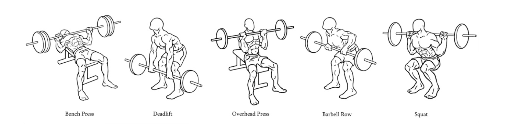

# Fitness Tracker App

# Barbell Exercise Classification and Rep Counter

<a target="_blank" href="https://datalumina.com/">
    
</a>

## Project Overview

This project follows a Master Level - Full Machine Learning Project: Coding a Fitness Tracker by Dave Abbelaar ([YouTube Playlist](https://www.youtube.com/playlist?list=PL-Y17yukoyy0sT2hoSQxn1TdV0J7-MX4K)).

The project aims to create Python scripts to process, visualize, and model accelerometer and gyroscope data to create a machine learning model that can classify barbell exercises and count repetitions. The system will analyze sensor data to automatically identify different barbell movements and track exercise performance.

<div align="center">
  
</div>

### Quantified Self

This project aligns with the principles of the Quantified Self movement: "The quantified self is any individual engaged in the self-tracking of any kind of biological, physical, behavioral, or environmental information. The self-tracking is driven by a certain goal of the individual, with a desire to act upon the collected information" (Hoogendoorn, M., & Funk, B., 2018). By tracking and analyzing exercise data, users can gain insights into their workout patterns, improve form, and track progress over time.

### Data Source

The raw sensor data used in this project can be downloaded from the [Datalumina documentation portal](https://docs.datalumina.io/s1eFpcdtbvRTMb). The dataset includes accelerometer and gyroscope readings from various barbell exercises, including bench press, deadlift, overhead press, barbell row, and squat. After downloading, place the data files in the `data/raw` directory.

Note: The data directories contain `.gitkeep` files to maintain the directory structure in version control, even though the actual data files are excluded via `.gitignore`. This ensures that the project structure remains intact when cloning the repository.

## Environment Setup

This project supports two methods for managing dependencies:

### Option 1: Python venv (Recommended)

This is a lightweight option using Python's built-in virtual environment:

```bash
# Create a virtual environment
python -m venv venv

# Activate the virtual environment
source venv/bin/activate  # On Unix/macOS
venv\Scripts\activate    # On Windows

# Install dependencies
pip install -r requirements.txt
```

### Option 2: Conda Environment

If you prefer using Conda, you can use the provided `environment.yml`:

```bash
# Create the conda environment
conda env create -f environment.yml

# Activate the environment
conda activate tracking-barbell-exercises
```

Choose the option that best suits your workflow. The venv approach is recommended for its simplicity and built-in Python support.

## Interactive Python Development

This project supports interactive Python development using Jupyter functionality in VS Code. To set this up:

1. Install the Jupyter kernel for your virtual environment:

```bash
# With your virtual environment activated
python -m ipykernel install --user --name=tracking-barbell-exercises
```

2. Configure VS Code:

   - Press `Cmd+Shift+P` (on macOS) or `Ctrl+Shift+P` (on Windows)
   - Type "Python: Select Interpreter"
   - Choose the `tracking-barbell-exercises` environment

3. Enable interactive Python mode:

   - Press `Cmd+Shift+P` (macOS) or `Ctrl+Shift+P` (Windows)
   - Choose one of:
     - "Jupyter: Create New Blank Notebook"
     - "Jupyter: Create Interactive Window"
     - Click the "Jupyter: Run Current File in Interactive Window" button (top-right corner)

4. Use Shift+Enter to run code cells interactively

Alternatively, you can use traditional Jupyter notebooks located in the `notebooks` directory for data exploration and analysis.

## Data Management

This project follows best practices for managing large sensor data files. The `/data/` directory is excluded from version control via `.gitignore`:

```plaintext
# exclude data from source control by default
/data/
```

Typically, you want to exclude this folder if it contains either sensitive data that you do not want to add to version control or large files.

## Duplicating the .env File

To set up your environment variables, you need to duplicate the `.env.example` file and rename it to `.env`. You can do this manually or using the following terminal command:

```bash
cp .env.example .env # Linux, macOS, Git Bash, WSL
copy .env.example .env # Windows Command Prompt
```

This command creates a copy of `.env.example` and names it `.env`, allowing you to configure your environment variables specific to your setup.

## Project Organization

```
├── LICENSE            <- Open-source license if one is chosen
├── README.md          <- The top-level README for developers using this project
├── data
│   ├── external       <- Data from third party sources
│   ├── interim        <- Intermediate data that has been transformed
│   ├── processed      <- The final, canonical data sets for modeling
│   └── raw            <- The original, immutable data dump
│
├── models             <- Trained and serialized models, model predictions, or model summaries
│
├── notebooks          <- Jupyter notebooks for exploration and documentation
│
├── reports           <- Generated analysis and visualizations
│   ├── figures       <- Generated plots and figures
│   └── development_presentation <- Project development presentation
│
├── src               <- Source code for use in this project
│   ├── __init__.py   <- Makes src a Python module
│   ├── data          <- Scripts to process data
│   ├── features      <- Scripts to turn raw data into features for modeling
│   ├── models        <- Scripts to train models and make predictions
│   └── visualization <- Scripts to create exploratory and results visualizations
│       ├── visualize.py          <- Main visualization module for sensor data
│       └── visualization_dev.py   <- Development process documentation
│
├── requirements.txt   <- Project dependencies for pip installation
├── environment.yml    <- Conda environment configuration
└── README.md         <- The top-level README for developers using this project

## Data Processing and Visualization

### Sensor Data Visualization

The project includes a comprehensive visualization module for analyzing sensor data:

```bash
# Generate all sensor data visualizations
python src/visualization/visualize.py
```

This will create dual-plot visualizations for each exercise-participant combination, showing:
- Accelerometer data (x, y, z axes) in the top panel
- Gyroscope data (x, y, z axes) in the bottom panel

The generated plots are saved as high-resolution PNG files in the `reports/figures` directory.

### Development Process

The visualization development process is documented in `src/visualization/visualization_dev.py`, which shows the progression from basic plots to the final implementation, including:

1. Initial data exploration with single column plots
2. Exercise and participant comparisons
3. Plot styling and configuration improvements
4. Development of the dual sensor plot functionality

### Best Practices

The visualization module follows several best practices:
- Uses non-interactive backend for headless execution
- Saves high-resolution (300 DPI) plots
- Provides clear progress reporting during plot generation
- Includes comprehensive docstrings and documentation
- Follows a clean project structure with separate production and development code

## Data Processing

The project follows a structured data processing pipeline that transforms raw sensor data into analysis-ready datasets.

### Dataset Creation

The dataset creation process is handled by `src/data/make_dataset.py` and includes:

1. **Data Loading**
   - Read raw CSV files from sensor recordings
   - Parse timestamps and sensor values
   - Organize data by participant and exercise

2. **Initial Processing**
   - Resample data to consistent frequency (200ms)
   - Align accelerometer and gyroscope readings
   - Create exercise set markers

### Outlier Removal

Outlier detection and removal (`src/data/remove_outliers.py`) supports multiple methods:

1. **Statistical Methods**
   - IQR (Interquartile Range) based detection
   - Chauvenet's criterion for normal distributions
   - Z-score based outlier detection

2. **Advanced Techniques**
   - Local Outlier Factor (LOF) for density-based detection
   - Moving window statistics for time-series context
   - Exercise-specific thresholds

### Example Usage

```python
# Load raw data and create initial dataset
from src.data.make_dataset import create_dataset
dataset = create_dataset(raw_data_path='data/raw')

# Remove outliers using different methods
from src.data.remove_outliers import remove_outliers

# Using IQR method
clean_data_iqr = remove_outliers(dataset, method='iqr')

# Using Chauvenet's criterion
clean_data_chauvenet = remove_outliers(dataset, method='chauvenet')

# Using Local Outlier Factor
clean_data_lof = remove_outliers(dataset, method='lof')
```

The cleaned datasets are saved in `data/interim/` with appropriate version markers.

## Feature Building

The project includes a comprehensive feature engineering module (`src/features/build_features.py`) that provides functions for data processing and clustering analysis.

### Available Functions

1. **Data Processing**
   - `load_cleaned_sensor_data()`: Load preprocessed sensor data
   - `interpolate_missing_values()`: Handle missing values in sensor data
   - `calculate_set_durations()`: Calculate exercise set durations
   - `apply_butterworth_filter()`: Apply low-pass filter to sensor data

2. **Clustering**
   - `create_clustered_dataframe()`: Create DataFrame with cluster assignments
   - `save_clustered_data()`: Save clustered data to pickle file

3. **Visualization**
   - `visualize_elbow_method()`: Plot elbow curve for optimal k selection
   - `plot_cluster_comparison()`: Compare clusters with exercise labels
   - `save_cluster_plot()`: Save high-quality cluster visualization

### Example Usage

Here's a quick example of how to use the clustering and visualization functions:

```python
# Load your data
data = load_cleaned_sensor_data()

# Visualize elbow curve to find optimal number of clusters
visualize_elbow_method(data, k_range=(2, 15))

# Compare clusters with exercise labels
plot_cluster_comparison(data, n_clusters=5)

# Save high-quality plot
save_dir = os.path.join('reports', 'development_presentation', 'images')
save_cluster_plot(data, n_clusters=5, save_dir=save_dir)
```

The generated plots will be saved in high resolution (300 DPI) in the specified directory.

---
